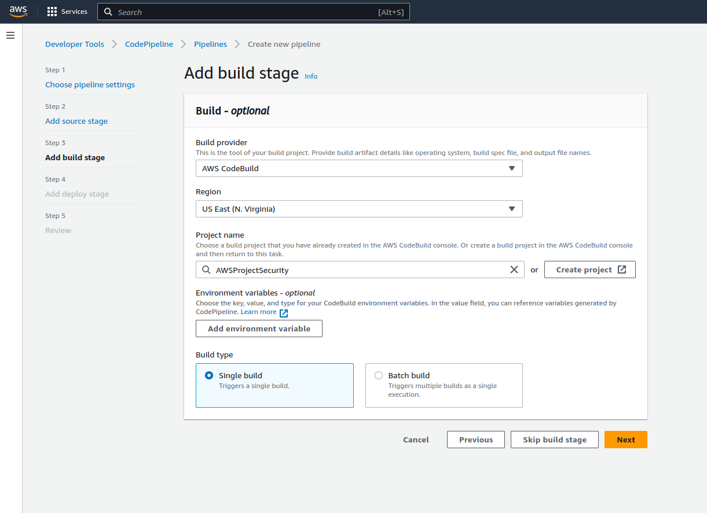

# Cloud Security in AWS | Implement SAST, SCA & DAST in AWS DevSecOps Pipeline from scratch and Security Services in AWS


## Integrating Security AWS CI/CD Pipeline

Connect Git bash with AWS CodeCommit


### IAM


### Clone Repo


Repo to Copy: https://github.com/mt2h/aws-vulnerable-code-without-buildspec


### Integrate SonarCloud

Repo: https://github.com/mt2h/aws-devsecops-repo-for-buildspec-with-sonarcloud-dummyvalues

Pipeline

```yaml
version: 0.1
phases:
  build:
    commands:
      - mvn verify sonar:sonar -Dsonar.projectKey=projectKey -Dsonar.organization=projectOrg -Dsonar.host.url=https://sonarcloud.io -Dsonar.login=token
```

Repo: https://github.com/mt2h/aws-devsecops-repo-for-buildspec-with-sonarcloud-actualvalues

### Create AWS Code Build project


### Build Pipeline


### Fix Code Coverage Issues en SonarCloud

Repo: https://github.com/mt2h/aws-devsecops-repo-with-changes-for-populating-code-coverage-on-sonarcloud


### Token on Secret Manager

Repo: https://github.com/mt2h/aws-devsecops-repo-with-secrets-manager-integration


Pipeline

```yaml
version: 0.1
env:
    secrets-manager:
      TOKEN: SecurityMt2h:SONAR_TOKEN
phases:
  build:
    commands:
      - mvn verify sonar:sonar -Dsonar.projectKey=javaprojectreachabilitymt2h -Dsonar.organization=javaprojectreachabilitymt2h -Dsonar.host.url=https://sonarcloud.io -Dsonar.login=$TOKEN 
```


### Implement quality gates using Sonar

Repo: https://github.com/mt2h/aws-devsecops-project

Pipeline 

```yaml
version: 0.1
env:
    secrets-manager:
      TOKEN: SecurityMt2h:SONAR_TOKEN
phases:
  build:
    commands:
      - mvn verify sonar:sonar -Dsonar.projectKey=javaprojectreachabilitymt2h -Dsonar.organization=javaprojectreachabilitymt2h -Dsonar.host.url=https://sonarcloud.io -Dsonar.login=$TOKEN 
      - sleep 5
      - |- 
        quality_status=$(curl -s -u $TOKEN: https://sonarcloud.io/api/qualitygates/project_status?projectKey=javaprojectreachabilitymt2h | jq -r '.projectStatus.status')
        echo "SonarCloud analysistatus is $quality_status"; 
        if [ $quality_status = "ERROR" ] ; then exit 1;fi
```

### Create AWS Pipeline a d automate AWS CodeBuild Project





