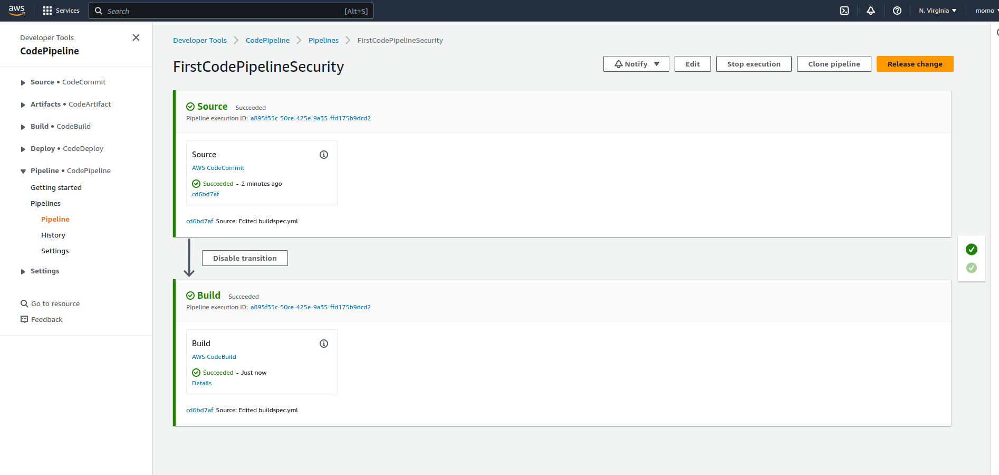
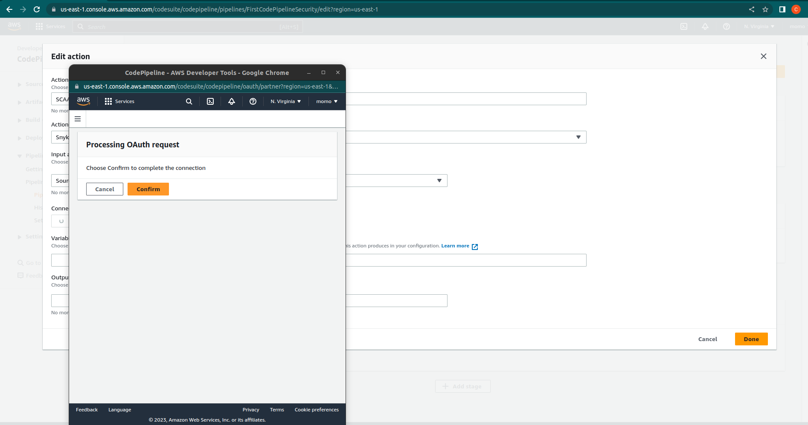
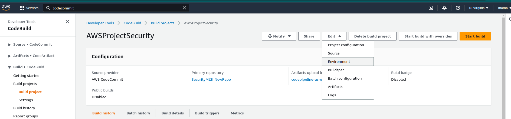
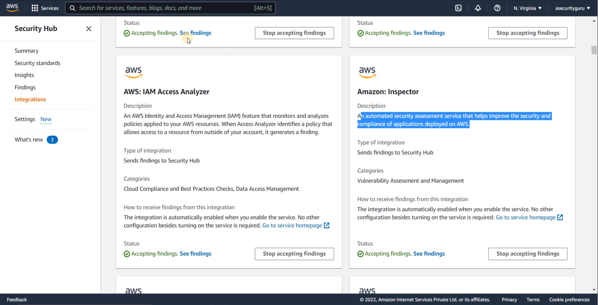
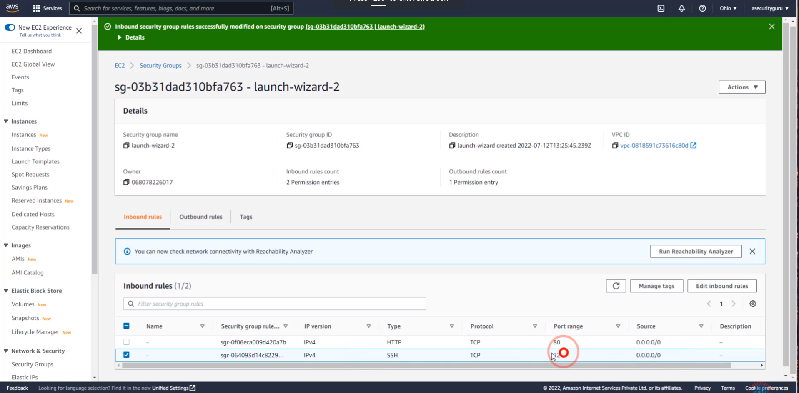
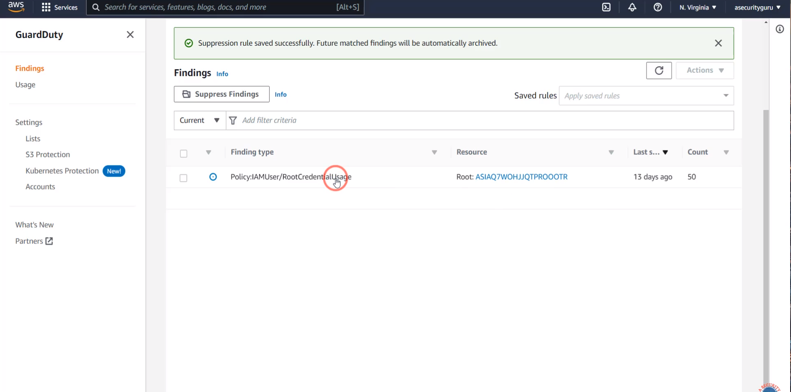
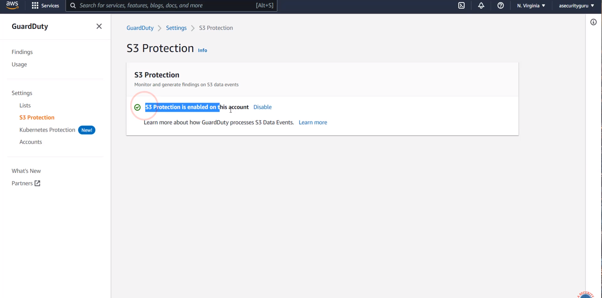
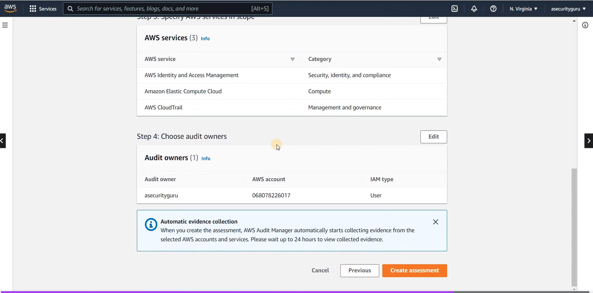
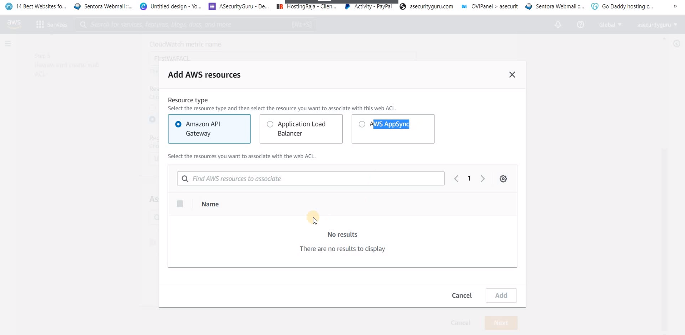

# Cloud Security in AWS | Implement SAST, SCA & DAST in AWS DevSecOps Pipeline from scratch and Security Services in AWS


## Integrating Security AWS CI/CD Pipeline

Connect Git bash with AWS CodeCommit


### IAM


### Clone Repo


Repo to Copy: https://github.com/mt2h/aws-vulnerable-code-without-buildspec


### Integrate SonarCloud

Repo: https://github.com/mt2h/aws-devsecops-repo-for-buildspec-with-sonarcloud-dummyvalues

Pipeline

```yaml
version: 0.1
phases:
  build:
    commands:
      - mvn verify sonar:sonar -Dsonar.projectKey=projectKey -Dsonar.organization=projectOrg -Dsonar.host.url=https://sonarcloud.io -Dsonar.login=token
```

Repo: https://github.com/mt2h/aws-devsecops-repo-for-buildspec-with-sonarcloud-actualvalues

### Create AWS Code Build project


### Build Pipeline


### Fix Code Coverage Issues en SonarCloud

Repo: https://github.com/mt2h/aws-devsecops-repo-with-changes-for-populating-code-coverage-on-sonarcloud


### Token on Secret Manager

Repo: https://github.com/mt2h/aws-devsecops-repo-with-secrets-manager-integration


Pipeline

```yaml
version: 0.1
env:
    secrets-manager:
      TOKEN: SecurityMt2h:SONAR_TOKEN
phases:
  build:
    commands:
      - mvn verify sonar:sonar -Dsonar.projectKey=javaprojectreachabilitymt2h -Dsonar.organization=javaprojectreachabilitymt2h -Dsonar.host.url=https://sonarcloud.io -Dsonar.login=$TOKEN 
```


### Implement quality gates using Sonar

Repo: https://github.com/mt2h/aws-devsecops-project

Pipeline 

```yaml
version: 0.1
env:
    secrets-manager:
      TOKEN: SecurityMt2h:SONAR_TOKEN
phases:
  build:
    commands:
      - mvn verify sonar:sonar -Dsonar.projectKey=javaprojectreachabilitymt2h -Dsonar.organization=javaprojectreachabilitymt2h -Dsonar.host.url=https://sonarcloud.io -Dsonar.login=$TOKEN 
      - sleep 5
      - |- 
        quality_status=$(curl -s -u $TOKEN: https://sonarcloud.io/api/qualitygates/project_status?projectKey=javaprojectreachabilitymt2h | jq -r '.projectStatus.status')
        echo "SonarCloud analysistatus is $quality_status"; 
        if [ $quality_status = "ERROR" ] ; then exit 1;fi
```

### Create AWS Pipeline a d automate AWS CodeBuild Project




### Integrate Snyk in AWS Pipeline





### Configure AWS CodeBuild store security tools artifacts in S3 Buckets


### Integrate OWASP ZAP in AWS DevSecOps Pipeline using BuildSpec Yaml

Repo: https://github.com/mt2h/aws-devsecops-repo-with-owasp-zap-dast-integration/blob/main/buildspec.yml

```yaml
version: 0.1
phases:
  build:
    commands:
    - |-
        apt-get update
        apt-get -y install wget
        apt-get -y install default-jdk
        wget https://github.com/zaproxy/zaproxy/releases/download/v2.11.1/ZAP_2.11.1_Linux.tar.gz
        tar -xvf ZAP_2.11.1_Linux.tar.gz
        cd ZAP_2.11.1
        ./zap.sh -cmd -quickurl https://www.example.com -quickprogress -quickout ../zap_report.html 
artifacts:
  files:
    - zap_report.html
```

### Create VPC Endpoint and update information AWS




## Case Study: Java Project DevSecOps


Repo: https://github.com/mt2h/aws-devsecops-endToEnd-pipeline

## Security Services in AWS

### AWS Security Hub Services

AWS Security Hub es un servicio de administración y aglutinamiento de la seguridad proporcionado por Amazon Web Services (AWS). Actúa como un centro de comando centralizado para la seguridad, recopilando, priorizando y analizando de manera automática los datos y hallazgos de seguridad de varios servicios de AWS, así como de socios de seguridad y herramientas de terceros.

La función principal de AWS Security Hub es brindar una visibilidad integral de la postura de seguridad de los recursos de AWS en una cuenta. Recopila datos de seguridad de servicios como Amazon GuardDuty, Amazon Inspector, Amazon Macie y AWS Identity and Access Management (IAM), entre otros. También puede integrarse con proveedores de seguridad externos para recopilar información adicional.

Una vez que los datos se recopilan y agregan en AWS Security Hub, se aplican reglas y estándares de seguridad para identificar posibles problemas y vulnerabilidades. Esto incluye la evaluación de configuraciones inseguras, la detección de comportamientos anómalos y la identificación de amenazas conocidas. Los hallazgos se priorizan según su gravedad y se presentan en un panel de control centralizado.

AWS Security Hub proporciona una interfaz de usuario intuitiva que permite a los usuarios ver y analizar los hallazgos de seguridad, así como tomar medidas correctivas. También se pueden generar informes y alertas automatizadas para facilitar la respuesta a incidentes y el cumplimiento de los estándares de seguridad.

Además, AWS Security Hub se integra con otros servicios de seguridad de AWS y herramientas de terceros, lo que permite una mayor automatización y una mejor capacidad de respuesta ante amenazas.


### Amazon Inspector

Amazon Inspector es un servicio de evaluación de seguridad automatizado de Amazon Web Services (AWS) que ayuda a identificar posibles vulnerabilidades y debilidades de seguridad en aplicaciones y recursos de infraestructura de AWS. Proporciona una forma escalable y eficiente de realizar evaluaciones de seguridad regulares y automatizadas en los entornos de AWS.

Amazon Inspector utiliza una combinación de análisis automatizados y evaluaciones basadas en reglas para identificar posibles problemas de seguridad. Escanea las instancias de EC2, los grupos de seguridad, las aplicaciones web y otros recursos de AWS en busca de vulnerabilidades conocidas, configuraciones inseguras y posibles brechas de seguridad.

El servicio proporciona una amplia variedad de reglas predefinidas basadas en las mejores prácticas de seguridad y estándares reconocidos, como el Centro Nacional de Seguridad Cibernética del Reino Unido (NCSC), el Centro de Internet Segura de Alemania (BSI) y el Foro de Incidentes de Respuesta y Seguridad de Nueva Zelanda (NZISF). Además, permite a los usuarios crear reglas personalizadas para abordar requisitos específicos.

Una vez que se completa la evaluación, Amazon Inspector genera informes detallados con una lista de hallazgos, clasificados por gravedad, y proporciona recomendaciones para corregir los problemas de seguridad identificados. Esto permite a los usuarios priorizar y remediar las vulnerabilidades de manera eficiente.

Amazon Inspector se integra con otros servicios de seguridad de AWS, como AWS Identity and Access Management (IAM), AWS CloudTrail y Amazon Simple Notification Service (SNS), para una gestión centralizada de las evaluaciones de seguridad y la notificación de resultados.




Steps to enable AWS Inspector for an EC2 instance:

1) Create an EC2 instance and enable port http:80 in the security group
2) SSM agent should be installed on EC2 instance 
(Reference: https://docs.aws.amazon.com/inspector/v1/userguide/inspector_installing-uninstalling-agents.html#ami-with-agent)
3) SSM agent should be running on EC2 instance





### Amazon Detective

Amazon Detective es un servicio de análisis de seguridad gestionado por Amazon Web Services (AWS) que ayuda a los usuarios a investigar y analizar de forma rápida y eficiente posibles problemas de seguridad en sus entornos de AWS. Utiliza la inteligencia artificial y el aprendizaje automático para recopilar, analizar y visualizar datos de registros de varios servicios de AWS, lo que permite identificar patrones, correlaciones y relaciones entre eventos de seguridad.

Amazon Detective se integra con servicios como Amazon CloudTrail, Amazon Virtual Private Cloud (VPC) Flow Logs y Amazon GuardDuty para recopilar datos relevantes sobre eventos de seguridad en la cuenta de AWS. Luego, aplica algoritmos avanzados para analizar esos datos y generar gráficos y visualizaciones que ayudan a comprender el flujo de eventos y las relaciones entre ellos.

El servicio proporciona una interfaz visual interactiva que permite a los usuarios explorar y navegar por los datos de manera intuitiva. Esto facilita la identificación de patrones sospechosos, el seguimiento de actividades maliciosas y el análisis de incidentes de seguridad en tiempo real.

Amazon Detective también genera métricas y recomendaciones para ayudar a los investigadores a priorizar las acciones de mitigación y tomar decisiones informadas sobre la seguridad. Estas recomendaciones se basan en las mejores prácticas de seguridad y en la experiencia acumulada de AWS.


### Amazon GuardDuty

Amazon GuardDuty es un servicio de seguridad gestionado por Amazon Web Services (AWS) que ayuda a proteger las cargas de trabajo en la nube contra amenazas y actividades maliciosas. Utiliza el análisis de comportamiento y la inteligencia artificial para monitorear continuamente las cuentas y los recursos de AWS, y detectar de manera proactiva actividades sospechosas o no autorizadas.

GuardDuty analiza los registros y los eventos generados por diversas fuentes de datos, como registros de VPC Flow, registros de DNS y registros de AWS CloudTrail. Luego, utiliza algoritmos y patrones de comportamiento para identificar actividades maliciosas, como intentos de acceso no autorizados, movimientos laterales, escaneo de puertos, uso de credenciales robadas y comportamientos anómalos de las instancias de Amazon EC2.

Cuando GuardDuty detecta una actividad sospechosa, genera alertas y notificaciones para que los administradores puedan tomar medidas correctivas. Estas alertas se pueden visualizar en la consola de administración de AWS, integrarse con herramientas de gestión de eventos y notificar mediante servicios como Amazon Simple Notification Service (SNS).

GuardDuty también proporciona información detallada sobre las alertas y ofrece recomendaciones sobre cómo mitigar las amenazas detectadas. Además, se integra con otros servicios de seguridad de AWS, como AWS CloudWatch y AWS Security Hub, para una gestión y respuesta centralizada de la seguridad.








### Amazon IAM Analyzer and basic implementation

Amazon IAM Analyzer, también conocido como AWS IAM Access Analyzer, es un servicio de seguridad de Amazon Web Services (AWS) que ayuda a los usuarios a identificar y corregir problemas de acceso no intencionados en sus políticas de control de acceso e identidad (IAM).

IAM Analyzer utiliza técnicas de análisis automatizado para examinar las políticas IAM y detectar posibles configuraciones de permisos de acceso que puedan ser consideradas riesgosas o permitir un acceso no autorizado a recursos de AWS. Estas configuraciones de permisos pueden incluir políticas de IAM que otorgan permisos excesivos, políticas mal configuradas o políticas que no siguen las mejores prácticas de seguridad.

Al utilizar IAM Analyzer, los usuarios pueden identificar y corregir estos problemas de seguridad antes de que se produzcan violaciones o brechas de seguridad. El servicio proporciona recomendaciones específicas para ayudar a los usuarios a ajustar sus políticas IAM y garantizar un acceso adecuado y seguro a los recursos de AWS.

IAM Analyzer se integra con AWS Identity and Access Management (IAM) y se puede utilizar a través de la consola de administración de AWS, la interfaz de línea de comandos de AWS (CLI) o las API de AWS. Es una herramienta útil para garantizar la seguridad y el cumplimiento de las políticas de acceso en entornos de AWS.


### Amazon Macie

Amazon Macie es un servicio de seguridad y privacidad automatizado proporcionado por Amazon Web Services (AWS) que utiliza la inteligencia artificial (IA) y el aprendizaje automático para identificar y proteger datos confidenciales en la nube. Su objetivo principal es ayudar a los usuarios a descubrir, clasificar y proteger automáticamente los datos sensibles almacenados en sus entornos de AWS.

Amazon Macie utiliza técnicas avanzadas de análisis de contenido para escanear y analizar datos almacenados en servicios como Amazon S3. Detecta automáticamente información confidencial, como números de tarjetas de crédito, números de seguridad social, direcciones de correo electrónico, contraseñas y otra información personalmente identificable (PII).

Una vez que Macie identifica datos confidenciales, clasifica y etiqueta automáticamente los datos en función de su sensibilidad y el tipo de información que contienen. Esto proporciona una visibilidad clara sobre qué datos son críticos y requieren medidas de seguridad adicionales.

Además de la clasificación de datos, Macie también monitorea el acceso y la actividad de los datos confidenciales. Puede detectar comportamientos anómalos y no autorizados, como intentos de acceso no autorizados o actividades sospechosas en torno a los datos confidenciales.

Amazon Macie proporciona informes y alertas para notificar a los usuarios sobre los hallazgos de datos confidenciales y las actividades inusuales. Estos informes y alertas ayudan a los usuarios a tomar medidas correctivas rápidas y a garantizar el cumplimiento de las políticas de seguridad y privacidad.


### AWS Audit Manager

AWS Audit Manager es un servicio proporcionado por Amazon Web Services (AWS) que facilita la realización de auditorías y la evaluación continua del cumplimiento de los controles de seguridad y las regulaciones de cumplimiento en los entornos de AWS. Permite a las organizaciones automatizar y simplificar el proceso de auditoría, ayudándoles a gestionar y demostrar la conformidad con los estándares y marcos de cumplimiento requeridos.

AWS Audit Manager proporciona una interfaz centralizada para gestionar y realizar auditorías internas y externas. Ayuda a los equipos de auditoría a definir y mantener un inventario de los controles de seguridad, establecer una programación de auditoría, asignar tareas a los auditores y colaborar en la recopilación de evidencia.

El servicio proporciona una amplia biblioteca de plantillas de evaluación basadas en estándares y marcos de cumplimiento comunes, como la Norma de Seguridad de Datos de la Industria de Tarjetas de Pago (PCI DSS), la Ley de Portabilidad y Responsabilidad del Seguro de Salud (HIPAA) y el Esquema Nacional de Seguridad (ENS) en Europa.

AWS Audit Manager permite a los usuarios realizar evaluaciones de cumplimiento en función de estas plantillas predefinidas o personalizadas, generando cuestionarios y evaluando la eficacia de los controles de seguridad implementados. Además, los usuarios pueden colaborar con los equipos responsables de los controles para recopilar y rastrear evidencia de cumplimiento.

Una vez completada la auditoría, AWS Audit Manager genera informes detallados y un panel de control para ayudar a los equipos de auditoría a revisar los resultados, identificar deficiencias y establecer planes de acción para abordar las áreas de mejora.





### Review result of all integrations performed with Security Hub


### WAF

WAF se refiere a Web Application Firewall (Firewall de Aplicaciones Web). Es un servicio de seguridad proporcionado por Amazon Web Services (AWS) que protege las aplicaciones web contra diversos tipos de ataques, como inyecciones de SQL, cross-site scripting (XSS) y ataques de fuerza bruta.

WAF actúa como un escudo protector entre los usuarios de una aplicación web y el servidor que la aloja. Examina el tráfico de entrada y salida de la aplicación web y aplica reglas de seguridad predefinidas o personalizadas para filtrar y bloquear solicitudes maliciosas o sospechosas.

Las características principales del servicio WAF de AWS son:

1. Reglas de seguridad personalizables: Permite definir reglas específicas para proteger las aplicaciones web de amenazas conocidas y desconocidas.

2. Protección contra ataques comunes: WAF puede detectar y bloquear ataques de OWASP Top 10, como inyecciones de SQL, XSS, ataques de inclusión de archivos y más.

3. Fácil integración: Puede integrarse con otros servicios de AWS, como Amazon CloudFront y Application Load Balancer, para proteger las aplicaciones web que se ejecutan en esos servicios.

4. Control granular: Proporciona un control detallado sobre qué tráfico permitir o bloquear según reglas personalizadas.

5. Capacidad de monitoreo y registro: WAF permite el monitoreo en tiempo real y el registro detallado de las solicitudes y los resultados de las reglas aplicadas.

Al utilizar WAF en AWS, las organizaciones pueden mejorar significativamente la seguridad de sus aplicaciones web, mitigando riesgos y protegiéndose contra amenazas comunes en el entorno en línea.





### Create Regular Expression Pattern Set in AWS WAF and assing it to ACL


